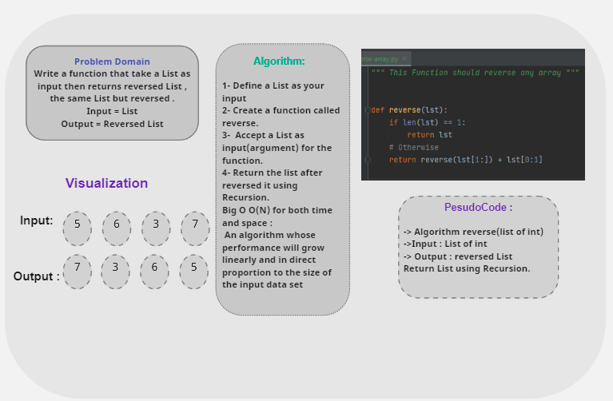

# Reverse an Array
<!-- Description of the challenge -->
Write a function to reverse an array without using build-in functions.

## Whiteboard Process

## Approach & Efficiency

Big O O(N) for both time and space :  
 An algorithm whose performance will grow linearly and in direct proportion to the size of the input data set.  
I choose using Recursion because I found an easy way to reverse a List without using built-in functions.

<!-- What approach did you take? Discuss Why. What is the Big O space/time for this approach? -->