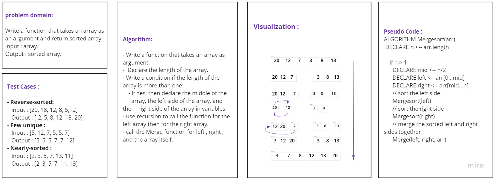

# Challenge Summary

<!-- Description of the challenge -->
Write a function that takes an array of integers and return a sorted array by tracing the algorithm using the pseudocode
provided.

## Whiteboard Process

## Approach & Efficiency

- Time complexity: O(nlog(n))
- Space complexity:O(n) 

## Solution

First you need to call the function then give it an array as an argument as below:

        merge_sort([5, 4, 7, 2, 8, 3])

        OutPut: [2, 3, 4, 5, 7, 8]

## Tests :

pytest test/test_merge_sort.py