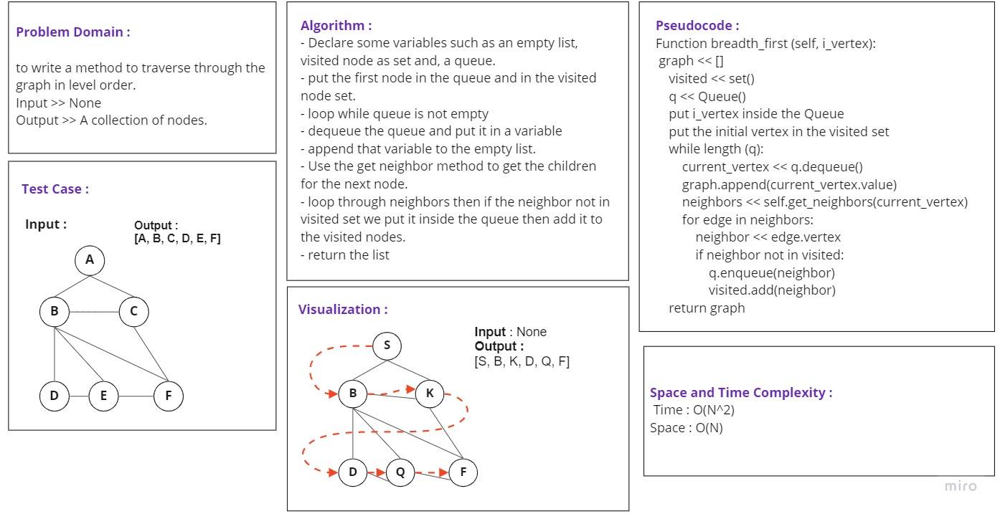

# Graphs

A graph is a non-linear data structure that can be looked at as a collection of vertices (or nodes) potentially
connected by line segments named edges.

## Challenge

Write a graph class with the following methods:

- add node
  - Arguments: value
  - Returns: The added node
  - Add a node to the graph
- add edge
  - Arguments: 2 nodes to be connected by the edge, weight (optional)
  - Returns: nothing
  - Adds a new edge between two nodes in the graph
  If specified, assign a weight to the edge
  Both nodes should already be in the Graph

- get neighbors
  - Arguments: node
  - Returns a collection of edges connected to the given node
  Include the weight of the connection in the returned collection

- size
  - Arguments: none
  - Returns the total number of nodes in the graph

- Breadth First:
  - Arguments : None 
  - returns A collection of nodes  in the order they were visited.
  Display the collection.

## Whiteboard Process

## Approach & Efficiency

- Add Node :
  - Time: O(1)
  - Space: O(1)
- Add Edge :
  - Time: O(1)
  - Space: O(1)
- Get Neighbors :
  - Time: O(1)
  - Space: O(1)
- Size :
  - Time: O(1)
  - Space: O(1)
- Breadth First: 
  - Time: O(N^2)
  - Space: O(N)
  
## API

- add_node(): add a vertex to the graph.
- add_edge(): add an edge to connect two vertexes in a graph.
- get nodes(): return a collection of vertexes in the graph.
- get neighbors(): return all the connected vertexes for the given node.
- size(): return the number of the nodes in the graph