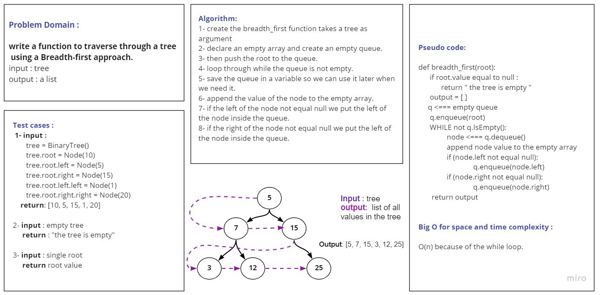

# Challenge Summary

Write a function called breadth first

- Arguments: tree
- Return: list of all values in the tree, in the order they were encountered
  Traverse the input tree using a Breadth-first approach

## Whiteboard Process

## Approach & Efficiency

- Time complexity is O(n), where n is the number of nodes. You need to traverse all nodes.
- Space complexity is O(n) as well - since at worst case you need to hold all vertices in the queue.

## Solution

First you need to make a Tree by typing the following :

    tree = BinaryTree()
    tree.root = Node(15)
    tree.root.left = Node(7)
    tree.root.right = Node(1)
    tree.root.left.left = Node(9)
    tree.root.left.right = Node(95)

Then you call the function and pass the tree as an argument :

    breadth_first(tree)

    Output: [15, 7, 1, 9, 95]

