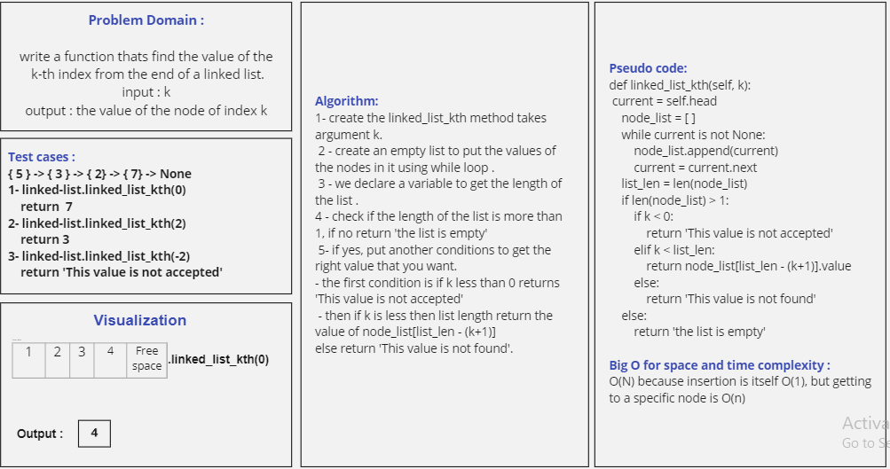

# Challenge Summary
 
linked_list_kth : write a function that's find the value of the k-th index from the end of a linked list.
input : k
output : the value of the node of index k

## Whiteboard Process
<!-- Embedded whiteboard image -->

## Approach & Efficiency
<!-- What approach did you take? Why? What is the Big O space/time for this approach? -->

For linked_list_kth : O(N) because insertion is itself O(1), but getting to a specific node is O(n)

## Solution
<!-- Show how to run your code, and examples of it in action -->
call the function first then,

for linked_list_kth method : you need to clarify the index of the value you want to get then write it as the following :
        
        { 15 } -> { 13 } -> { 0 } -> { 12 } -> { 7 } -> { 5 } -> { 6 } -> None
        name_of_instance = class_name()
        # to add 5 to the end of your list.
        name_of_instance.linked_list_kth(3) #this method to call your function inside a class 
      
        output : 12

