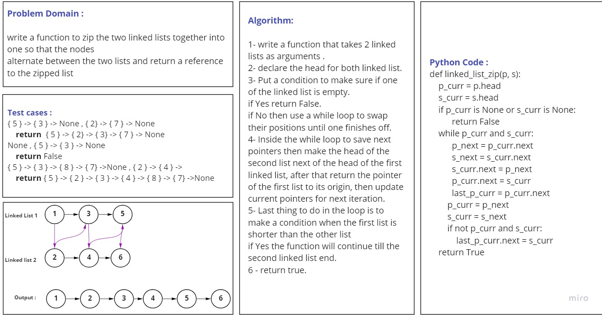

# Challenge Summary
Write a function takes 2 linked lists as parameters and Zip the two linked lists together into one so that the nodes 
alternate between the two lists and return a reference to the zipped list.

## Whiteboard Process
<!-- Embedded whiteboard image -->

## Approach & Efficiency
<!-- What approach did you take? Why? What is the Big O space/time for this approach? -->
For linked_list_zip method: O(N) for time because there is a while loop inside the function.

## Solution
<!-- Show how to run your code, and examples of it in action -->
for linked_list_zip method : you need to give the function 2 Linked-lists as arguments,
so you can write the code as the following steps :

        name_of_instance1 = class_name()
        name_of_instance2 = class_name()
        # add number of Nodes for each linked list by using one of the previous insertion methods.
         Linked_list1 = '{ 1 } -> { 3 } -> { 5 } -> None'
         Linked_list2 = '{ 0 } -> { 2 } -> { 4 } -> None'
        Linked_list1.linked_list_zip(Linked_list1, Linked_list2) 
      
        output : { 1 } -> { 0 } -> { 3 } -> { 2 } -> { 5 } -> { 4 } -> None
