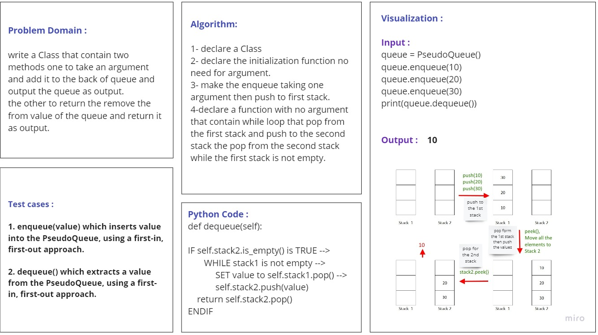

# Challenge Summary
<!-- Description of the challenge -->
write a Class that contain two methods one to take an argument and add it to the back of queue and output the queue as output.
the other to return the removed value from the queue and return it as output.

## Whiteboard Process
<!-- Embedded whiteboard image -->

## Approach & Efficiency
<!-- What approach did you take? Why? What is the Big O space/time for this approach? --> 
For enqueue method: O(1): the same as push method in class stack.

For dequeue method:O(n): There is a while loop because we want to use a first-in, first-out approach. 
## Solution
<!-- Show how to run your code, and examples of it in action -->

if you want to enqueue:

    stack = PseudoQueue()
    stack.enqueue(1)
    stack.enqueue(3)
    stack.enqueue(5)
    stack.enqueue(7)
    print(stack.__str__()) # to see the output 

    Output: 7 5 3 1 
 
if you want to use dequeue method to remove the first value you inserted:

    stack.dequeue() # This will return the value we removed 
    print(stack.__str__()) # this will show the PseudoQueue after we deleted the value
    
    Output : 
    1
    7 5 3

