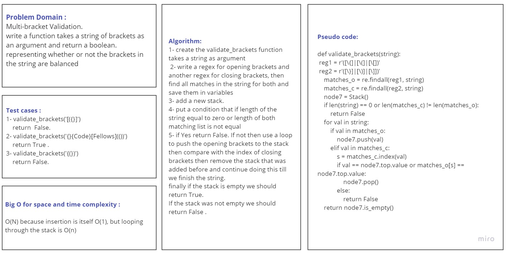
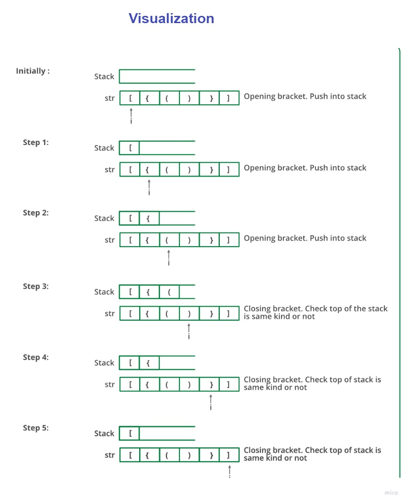

# Challenge Summary
Write a function called validate brackets
- Arguments: string

Return: boolean
- representing whether the brackets in the string are balanced

## Whiteboard Process

## Approach & Efficiency
Time and space complexity for this method : O(n) because we are using a for loop to make sure
if the brackets in the string are balanced or not 

## Solution
To run this function you need to call the function and pass a string as an argument 

     validate_brackets('()[[Extra Characters]]')
     
     Output : True 

Tests : 

to run tests : 

pytest test/test_stack_queue_brackets.py