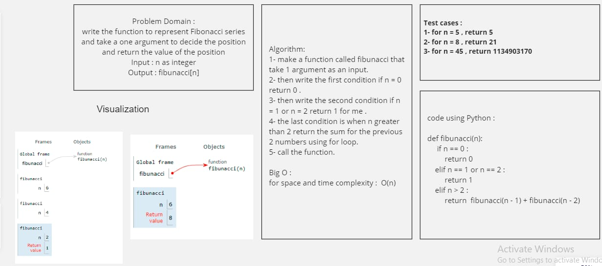
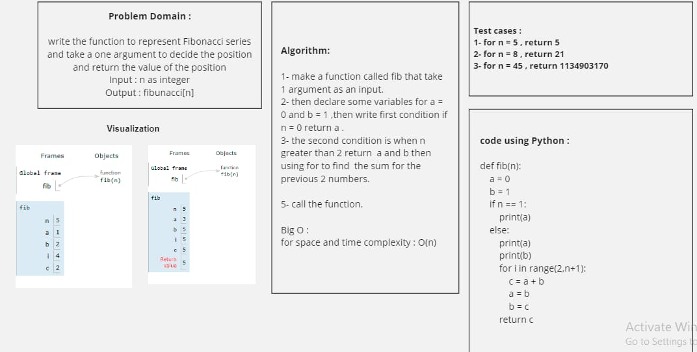

## Fibonacci Series:
## code challenge 04
write the function to represent Fibonacci series which take an argument to decide the position and return the value of the position

Input : n as integer

Output : fibonacci[n]

In two different ways using for loop and recursion 

## Whiteboard : 

