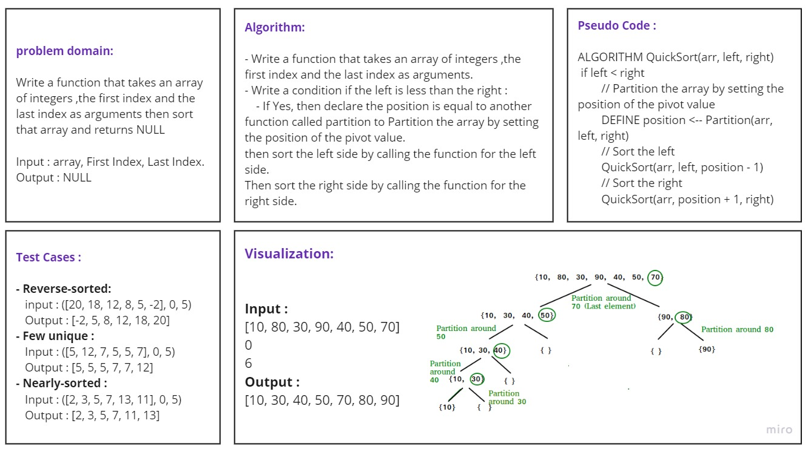

# Challenge Summary
Write a function that takes an array of integers the first index and the last index then sort that array by tracing the
algorithm using the pseudocode provided.
Input : arr, First Index, Last Index.
Output :  None

## Whiteboard Process

## Approach & Efficiency
- Time complexity : O(n^2)
- Space complexity : O(nlog n)

## Solution

First you need to call the function then give it array, First Index, and Last Index as arguments as below:
        
        arr = [5, 4, 7, 2, 8, 3]
        quick_sort(arr, 0, 5)
        print(arr)

        OutPut: [2, 3, 4, 5, 7, 8]

## Tests :

pytest test/test_quick_sort.py

