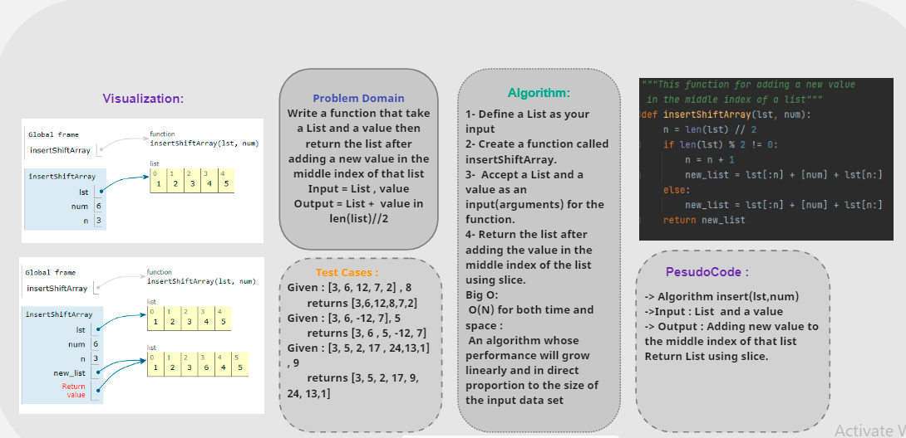
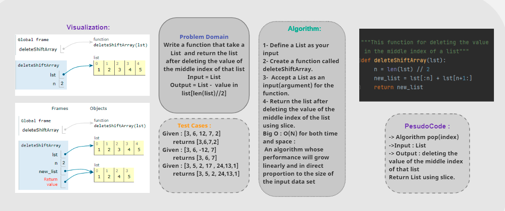

# Insert to Middle of an Array
**Challenge 01 :**  
write a function that takes an array and a value as an input then return an array with the new value added at the middle index. 
  
**Challenge 02 :**  
write a function that removes an element from the middle index and shifts other elements in the array to fill the new gap.

## Whiteboard Process
<!-- Embedded whiteboard image -->
 
 

 
## Approach & Efficiency
Big O ,O(N) for both time and space :  
 An algorithm whose performance will grow linearly and in direct proportion to the size of the input data set.  
I choose using Recursion because I found an easy way to reverse a List without using built-in functions.
