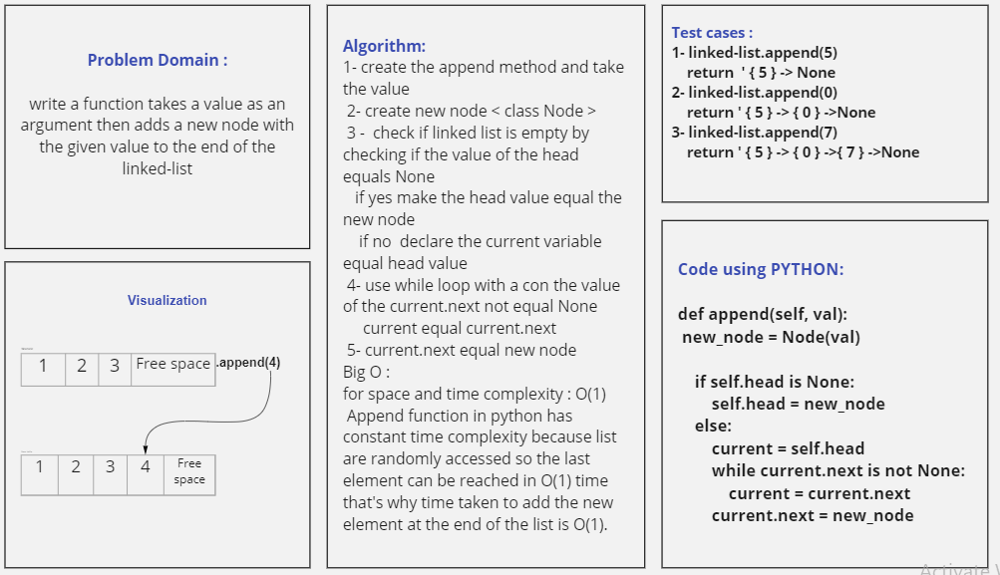

# Challenge Summary
 
write another 3 method and add them to the linked-list class:
- append method :adds a new node with the given value to the end of the list

- insert_before method : adds a new node with the given new value immediately before the first node that has the value specified

- insert_after method :adds a new node with the given new value immediately after the first node that has the value specified

## Whiteboard Process
<!-- Embedded whiteboard image -->

## Approach & Efficiency
<!-- What approach did you take? Why? What is the Big O space/time for this approach? -->
for append method : O(1)  because list are randomly accessed so the last element can be reached in 
O(1) time that's why time taken to add the new element at the end of the list is O(1).

For insert_before : O(N) because insertion is itself O(1), but getting to a specific node is O(n)

For insert_after : O(N) because insertion is itself O(1), but getting to a specific node is O(n)
## Solution
<!-- Show how to run your code, and examples of it in action -->
call the function first then,

for append method : you need to clarify the value you want to add then write it as the following :
        
        name_of_instance = class_name()
        # to add 5 to the end of your list.
        name_of_instance.append(5) #this method to call your function inside a class 
      
        output : {5} -> None

for insert_before method : you need to give the function 2 arguments 
the first one will be added before the second argument for the same list 

        name_of_instance = class_name()
        # to add 7 before Node 5 of your list.
        name_of_instance.append(7 , 5)
        
        output : {7} -> {5} -> None

for insert_after method : you need to give the function 2 arguments 
the first one will be added after the second argument for the same list 
     
        name_of_instance = class_name()
        # to add 3 before Node 7 of your list.
        name_of_instance.append(3 , 7)
        
        output : {7} -> {3} -> {5} -> None